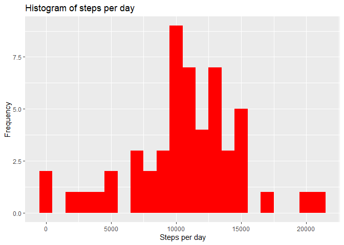
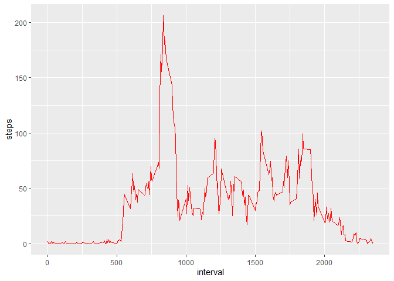
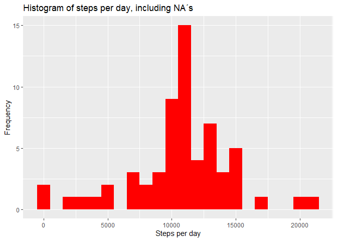
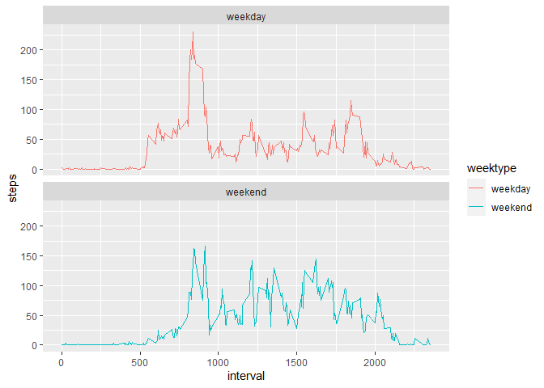

## Loading and preprocessing the data

#Install packages and load

```r
library(knitr)
library(lubridate)
```

```
## Warning: package 'lubridate' was built under R version 4.0.5
```

```
## 
## Attaching package: 'lubridate'
```

```
## The following objects are masked from 'package:base':
## 
##     date, intersect, setdiff, union
```

```r
library(dplyr)
```

```
## Warning: package 'dplyr' was built under R version 4.0.5
```

```
## 
## Attaching package: 'dplyr'
```

```
## The following objects are masked from 'package:stats':
## 
##     filter, lag
```

```
## The following objects are masked from 'package:base':
## 
##     intersect, setdiff, setequal, union
```

```r
library(ggplot2)
```

```
## Warning: package 'ggplot2' was built under R version 4.0.5
```

##Load and process the data

```r
data1 <- read.csv("activity.csv", header = TRUE, sep = ',', colClasses = c("numeric", "character",
                                                                          "integer"))
```

#Correct the date using lubridate

```r
data1$date <- ymd(data1$date)
```

#Check the data

```r
str(data1)
```

```
## 'data.frame':	17568 obs. of  3 variables:
##  $ steps   : num  NA NA NA NA NA NA NA NA NA NA ...
##  $ date    : Date, format: "2012-10-01" "2012-10-01" ...
##  $ interval: int  0 5 10 15 20 25 30 35 40 45 ...
```


```r
head(data1)
```

```
##   steps       date interval
## 1    NA 2012-10-01        0
## 2    NA 2012-10-01        5
## 3    NA 2012-10-01       10
## 4    NA 2012-10-01       15
## 5    NA 2012-10-01       20
## 6    NA 2012-10-01       25
```

## What is mean total number of steps taken per day?


```r
steps <- data1 %>%
  filter(!is.na(steps)) %>%
  group_by(date) %>%
  summarize(steps = sum(steps)) %>%
  print
```

```
## # A tibble: 53 x 2
##    date       steps
##    <date>     <dbl>
##  1 2012-10-02   126
##  2 2012-10-03 11352
##  3 2012-10-04 12116
##  4 2012-10-05 13294
##  5 2012-10-06 15420
##  6 2012-10-07 11015
##  7 2012-10-09 12811
##  8 2012-10-10  9900
##  9 2012-10-11 10304
## 10 2012-10-12 17382
## # ... with 43 more rows
```

#Make a histogram of steps pr. day

```r
ggplot(steps, aes(x = steps)) +
  geom_histogram(fill = "red", binwidth = 1000) +
  labs(title = "Histogram of steps per day", x = "Steps per day", y = "Frequency")
```

<!-- -->

#Calculate and report the mean and median of the total number of steps taken per day

```r
mean_steps <- mean(steps$steps, na.rm = TRUE)
median_steps <- median(steps$steps, na.rm = TRUE)
```
#Mean

```r
mean_steps
```

```
## [1] 10766.19
```
#Median

```r
median_steps
```

```
## [1] 10765
```

#Answer Q1: Mean steps are 10766 and median steps are 10765.


## What is the average daily activity pattern?

#Make a time series plot (i.e. \color{red}{\verb|type = "l"|}type = "l") of the 5-minute interval (x-axis) and the average number of steps taken, averaged across all days (y-axis)

#Calculate the average number of steps taken in each 5-minute interval per day

```r
interval <- data1 %>%
  filter(!is.na(steps)) %>%
  group_by(interval) %>%
  summarize(steps = mean(steps))
```

#Time series of the 5-minute interval and average steps taken

```r
ggplot(interval, aes(x=interval, y=steps)) +
  geom_line(color = "red")
```

<!-- -->

#Maximum steps across all the days (average)

```r
interval[which.max(interval$steps),]
```

```
## # A tibble: 1 x 2
##   interval steps
##      <int> <dbl>
## 1      835  206.
```

#Answer Q2: The interval of 835 has an average of 206 on the highest count


## Imputing missing values

#Calculate and report the total number of missing values in the dataset

```r
sum(is.na(data1$steps))
```

```
## [1] 2304
```

#NA´s are 2304

#Devise a strategy for filling in all of the missing values in the dataset. The strategy does not need to be sophisticated. For example, you could use the mean/median for that day, or the mean for that 5-minute interval, etc.

#Create a new dataset that is equal to the original dataset but with the missing data filled in.

#Fill in missing NA´s with the average number of steps in the same 5-min interval

```r
data1_full <- data1
nas <- is.na(data1_full$steps)
avg_interval <- tapply(data1_full$steps, data1_full$interval, mean, na.rm=TRUE, simplify=TRUE)
data1_full$steps[nas] <- avg_interval[as.character(data1_full$interval[nas])]
```

#check that here are no more NA´s

```r
sum(is.na(data1_full$steps))
```

```
## [1] 0
```

#No more NA´s!

#Make a histogram of the total number of steps taken each day and Calculate and report the mean and median total number of steps taken per day. Do these values differ from the estimates from the first part of the assignment? What is the impact of imputing missing data on the estimates of the total daily number of steps?

#Calculate the number of steps taken in each 5-minute interval per day

```r
steps_full <- data1_full %>%
  filter(!is.na(steps)) %>%
  group_by(date) %>%
  summarize(steps = sum(steps)) %>%
  print
```

```
## # A tibble: 61 x 2
##    date        steps
##    <date>      <dbl>
##  1 2012-10-01 10766.
##  2 2012-10-02   126 
##  3 2012-10-03 11352 
##  4 2012-10-04 12116 
##  5 2012-10-05 13294 
##  6 2012-10-06 15420 
##  7 2012-10-07 11015 
##  8 2012-10-08 10766.
##  9 2012-10-09 12811 
## 10 2012-10-10  9900 
## # ... with 51 more rows
```

#Histogram

```r
ggplot(steps_full, aes(x = steps)) +
  geom_histogram(fill = "red", binwidth = 1000) +
  labs(title = "Histogram of steps per day, including NA´s", x = "Steps per day", y = "Frequency")
```

<!-- -->

#Calculate the mean and median steps with the filled in values

```r
mean_steps_full <- mean(steps_full$steps, na.rm = TRUE)
median_steps_full <- median(steps_full$steps, na.rm = TRUE)
```

#mean

```r
mean_steps_full
```

```
## [1] 10766.19
```

#median

```r
median_steps_full
```

```
## [1] 10766.19
```

#Answer Q3: Both the mean and the median are equal to the same value of 10766 after filling in NA´s


## Are there differences in activity patterns between weekdays and weekends?

#Create a new factor variable in the dataset with two levels – “weekday” and “weekend” indicating whether a given date is a weekday or weekend day

```r
data1_full <- mutate(data1_full, weektype = ifelse(weekdays(data1_full$date) == "Saturday" | weekdays(data1_full$date) == "Sunday", "weekend", "weekday"))
data1_full$weektype <- as.factor(data1_full$weektype)
head(data1_full)
```

```
##       steps       date interval weektype
## 1 1.7169811 2012-10-01        0  weekday
## 2 0.3396226 2012-10-01        5  weekday
## 3 0.1320755 2012-10-01       10  weekday
## 4 0.1509434 2012-10-01       15  weekday
## 5 0.0754717 2012-10-01       20  weekday
## 6 2.0943396 2012-10-01       25  weekday
```

#Make a panel plot containing a time series plot (i.e. \color{red}{\verb|type = "l"|}type = "l") of the 5-minute interval (x-axis) and the average number of steps taken, averaged across all weekday days or weekend days (y-axis).

```r
interval_full <- data1_full %>%
  group_by(interval, weektype) %>%
  summarise(steps = mean(steps))
```

```
## `summarise()` has grouped output by 'interval'. You can override using the `.groups` argument.
```

```r
s <- ggplot(interval_full, aes(x=interval, y=steps, color = weektype)) +
  geom_line() +
  facet_wrap(~weektype, ncol = 1, nrow=2)
print(s)
```

<!-- -->

#Answer Q4: From the two plots it seems that the person is more active in the morning on weekdays, but in general more active in the weekends.
